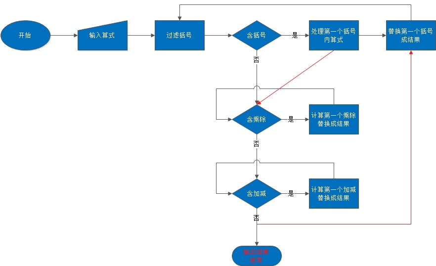

# Python学习day5作业

## 计算器
作业需求

计算器：
>1. 算式支持加减乘除及括号
>2. 有历史记录

### 1. 程序说明

计算器实现功能如下：

- [x] 算式支持加减乘除及括号
- [x] 有历史记录


[ygqygq2的博客地址](http://blog.csdn.net/ygqygq2)
作业地址：
[https://git.oschina.net/ygqygq2/python_homework/tree/master/day5作业](https://git.oschina.net/ygqygq2/python_homework/tree/master/day5作业)

### 2. 基本流程图



### 3. 程序结构:


```
.
├── Calculator  # 计算器主程目录
│   ├── __init__.py
│   ├── bin  # 执行文件目录
│   │   ├── __init__.py
│   │   ├── calculator.py  # 计算器执行程序
│   ├── conf  # 配置目录
│   │   ├── __init__.py
│   │   └── settings.py  # 配置文件
│   ├── core  # 主要逻辑程序目录
│   │   ├── __init__.py
│   │   ├── logger.py  # 日志记录模块
│   │   └── main.py  # 主逻辑程序
│   └── log  # 日志根目录
│       ├── __init__.py
│       └── history.log  # 计算器历史日志
├── README.md   # readme文件
├── calculator.jpg  # 基本流程图
```

### 4. 程序测试

`python Calculator/bin/calculator.py`
```
**************Welcome to calculator!**************
Please input your expression[q to quit]：1 - 2 * ( (60-30 +(-40/5) * (9-2*5/3 + 7 /3*99/4*2998 +10 * 568/14 )) - (-4*3)/ (16-3*2) )
The expression result：2776672.6952380957
--------------------------------------------------
Please input your expression[q to quit]：1/(2-2)+3*8
Do not allow the divisor is 0!
```

```
**************Welcome to calculator!**************
Please input your expression[q to quit]：1+1+3
The expression result：5.0
--------------------------------------------------
Please input your expression[q to quit]：q
*********************Bye bye**********************
```